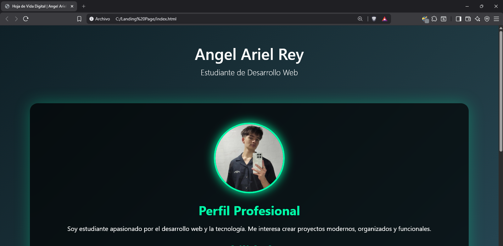
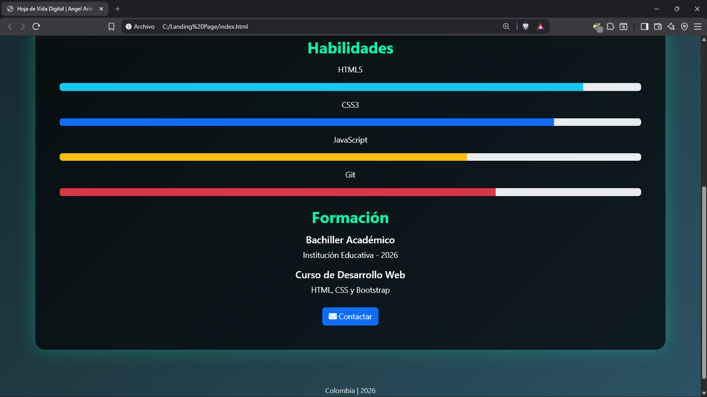
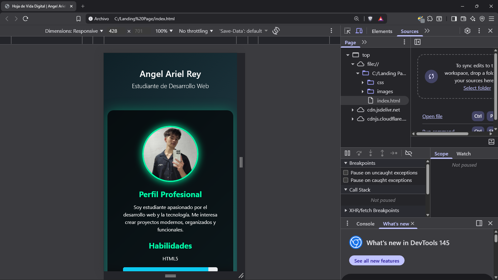

Landing Page – Hoja de Vida Digital

1. Información General
   
Nombre del proyecto: Landing Page Hoja de Vida Digital
Estudiante: Angel Ariel Rey
Fecha: 2026
Curso: CALIDAD SERVICIO DE SOFTWARE 3 - Instituto I3

------------------------------------------------------------------------------------

2. Descripción del Proyecto
   
Este proyecto consiste en el desarrollo de una landing page basada en mi hoja de vida profesional. La idea fue transformar una hoja de vida tradicional en una versión digital, moderna y visualmente atractiva.
La página muestra mi perfil profesional, habilidades y formación académica de forma organizada y accesible desde cualquier dispositivo.

¿Qué problema soluciona?
Permite presentar mi información profesional de manera más dinámica y actual, en lugar de usar únicamente un documento en PDF.

¿Para quién está pensado?
Está pensado para profesores, reclutadores o cualquier persona interesada en conocer mi perfil profesional de manera rápida y clara.

--------------------------------------------------------------------------------------

3. Tecnologías Utilizadas

HTML5 semántico
CSS3
Bootstrap
Git
GitHub
ChatGPT (utilizado como herramienta de apoyo para mejorar estilos, resolver errores y organizar la documentación)

-----------------------------------------

4. Estructura del Proyecto
   
Landing-Page-IA

 ├── index.html
 
 ├── css/
 
 │    └── styles.css
 
 ├── images/
 
 │    ├── Foto.png
 
 │    ├── inicio.png
 
 │    ├── habilidades.png
 
 │    └── responsive.png
 
 └── README.md
 
 
Explicación

index.html: Contiene la estructura principal de la página.
css/styles.css: Archivo donde se encuentran los estilos personalizados.
images/: Carpeta donde se almacena la imagen de perfil.
README.md: Documento con la explicación completa del proyecto.

--------------------------------------------------
5. Funcionalidades

Estructura con etiquetas HTML5 semánticas.

Diseño moderno utilizando Bootstrap.

Sección de perfil profesional.

Barras de habilidades visuales.

Diseño responsive que se adapta a celulares.

Botón de contacto con enlace a correo electrónico.

Animación de entrada al cargar la página.

-----------------------------------------

6. Capturas de Pantalla

------------------------------------------------

7. Cómo Ejecutar el Proyecto

Descargar o clonar el repositorio desde GitHub.

Abrir la carpeta del proyecto.

Ejecutar el archivo index.html en el navegador.

No requiere instalación adicional.

Otra alternativa es ingresando a este link de GitHub Pages: https://angelreyzzz.github.io/Landing-Page-IA/

------------------------------------------------------

8. Mejoras Futuras
   
En el futuro me gustaría:
Agregar un formulario funcional con validación en JavaScript.
Implementar envío real de correos.
Añadir más animaciones y efectos visuales.
Mejorar la accesibilidad.
Uso de Inteligencia Artificial

La inteligencia artificial fue utilizada como herramienta de apoyo para:

Mejorar estilos CSS.
Optimizar la organización del código.
Resolver errores.
Redactar la documentación.

Sin embargo, todo el código fue revisado, entendido y modificado por mí antes de ser publicado.

--------------------------------------

Este proyecto me permitió aplicar lo aprendido desde HTML básico hasta una página más organizada y profesional, usando GitHub para gestionar el código. Tengo pensado seguir aprendiendo más de este tipo de programacion por mi cuenta para mejorar mi calidad en futuros proyectos.
